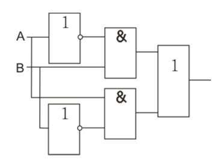
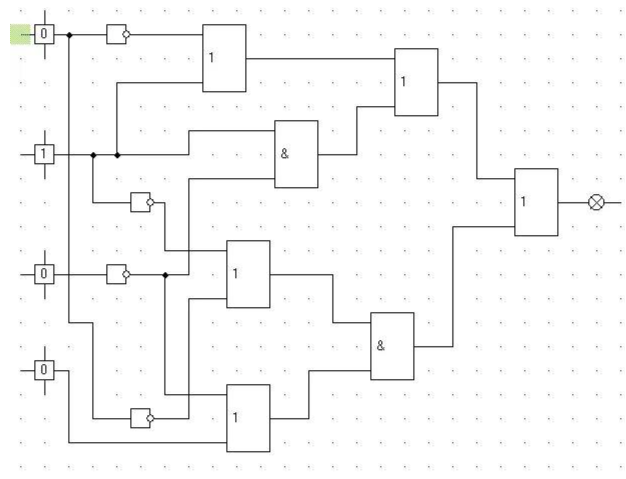
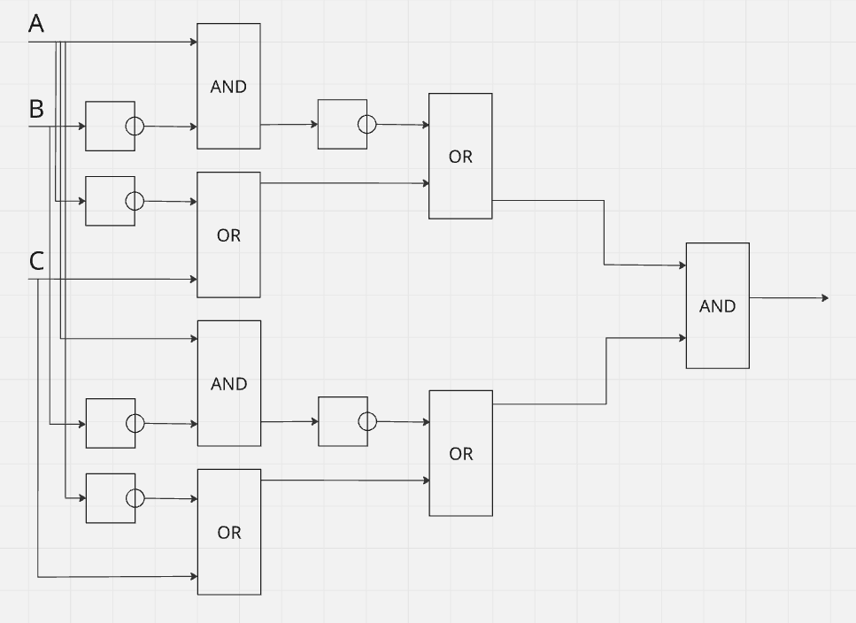
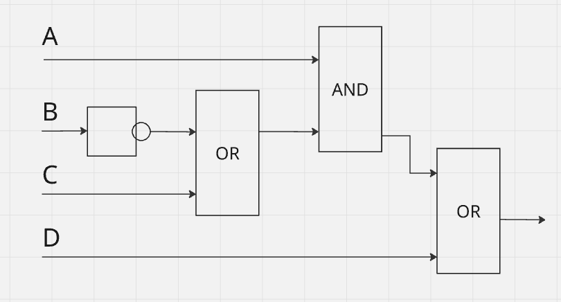

# Часть 1

## Пример 1

Вид в схеме:

Вид в формуле:
(A' & B) | (A & B')

## Пример 2

Вид в схеме:

Вид в формуле:
((A' | B) | (B & C')) | (B' | A') & (C' | D)

Подставим значения:
((0' | 1) | (1 & 0')) | (1' | 0') & (0' | 0)

Ответ на пример: 1

# Часть 2

## Пример 1

Вид в формуле:
(A∧¬B)→(C∨¬A)

Для более удобного представления в схеме нам надо убрать импликацию, т.к. нет отдельного блока для нее.
¬(A∧¬B)∨(C∨¬A)

Вид в схеме:

## Пример 2

Вид в формуле:
¬(A∧(B→C))∨D

Избавляемся от импликации:
¬(A∧(¬B∨C))∨D

Вид в схеме:

